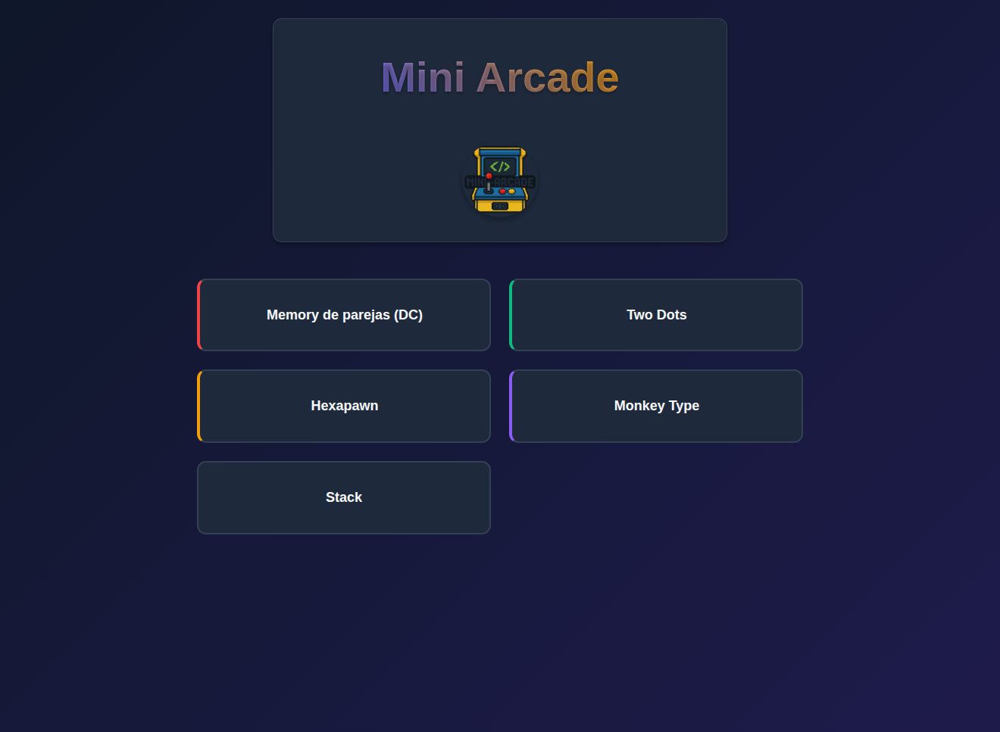

# 🎮 Mini Arcade ✨

A collection of web games — all in one site, built with modern web technologies.



## Description

This project is a collection of small web games built for fun and learning.  
Some were born from online courses, while others came from curiosity — experimenting with web APIs, design ideas, or simply exploring how far plain web technologies can go.

## Live Demo 🌐

The project is available online via GitHub Pages:

**[🎮 Play Now - Mini Arcade](https://mini-arcade-dev.vercel.app/)**

## Design 🎨

See the UI design in [Figma](https://www.figma.com/design/FEBHZo4guKObNeA8UTbSfK/Mini-Arcade?node-id=0-1&t=gLYkOVYzIx4Otxnm-1)

## Stack 🛠️

### Web

- [Astro](https://astro.build/)
- [Tailwind CSS](https://tailwindcss.com/)
- [TypeScript](https://www.typescriptlang.org/)

### Games

#### Vanilla technologies (HTML, CSS, JS)

- Hexapawn
- Memory
- Two Dots

#### React

- Hangman

## Project Structure 📁

```plaintext
mini-arcade/
├── astro.config.mjs
├── package.json
├── tsconfig.json
├── public/
│   ├── hexapawn/
│   │   └── js/
│   ├── images/
│   └── twodots/
│       └── js/
└── src/
    ├── components/
    │   ├── GameCard.astro
    │   ├── Section.astro
    │   ├── games/
    │   │   ├── HangmanGame.astro
    │   │   ├── HexapawnGame.astro
    │   │   ├── MemoryGame.astro
    │   │   ├── TwodotsGame.astro
    │   │   ├── hangman/
    │   │   ├── hexapawn/
    │   │   ├── memory/
    │   │   │   ├── hooks/
    |   |   |   ├── GameBoard.tsx
    │   │   │   ├── GameControls.tsx
    │   │   │   ├── MemoryConfigForm.tsx
    │   │   │   ├── MemoryGame.tsx
    |   |   |   ├── MemoryGameClient.tsx
    │   |   │   └── PlayerInfo.tsx
    │   │   └── twodots/
    │   └── sections/
    │       ├── Footer.astro
    │       ├── Form.astro
    │       ├── Games.astro
    │       ├── Header.astro
    │       └── Hero.astro
    ├── constants/
    │   └── games.ts
    ├── images/
    │   ├── avatars/
    │   └── memory/
    │       └── cards/
    ├── layouts/
    │   └── Layout.astro
    ├── lib/
    │   ├── auth.ts
    │   └── supabase.ts
    ├── pages/
    │   ├── index.astro
    │   ├── login.astro
    │   ├── signup.astro
    │   └── games/
    ├── styles/
    │   ├── global.css
    │   ├── hexapawn/
    │   ├── memory/
    │   └── twodots/
    └── types/
        └── database.ts
```

## Contributing 🤝

Contributions are welcome!  
If you have suggestions or find bugs, please open an issue or submit a pull request.

## TODO 📝

### Web Development

- [ ] Aprender a usar el componente `<Image>` de Astro para optimizar imágenes
- [ ] Improve mobile responsiveness
- [ ] Memory Game
  - [ ] Form
    - [ ] Usar base de datos para guardar el nick
- [ ] Complete migration to Tailwind CSS

### Games to be completed

- [X] Complete Two Dots
- [ ] Complete MonkeyType
- [ ] Complete Stack
- [X] Hangman

### Features

- [ ] Add global scoring system
- [ ] Implement multiplayer mode
- [ ] Add more classic titles
- [ ] PWA (Progressive Web App)

## License 📄

This project is licensed under the MIT License - see the [LICENSE](LICENSE) file for more details.

---

👨‍💻 Developed with ❤️ by [Luis Marrero](https://luismarrer.github.io/en)
