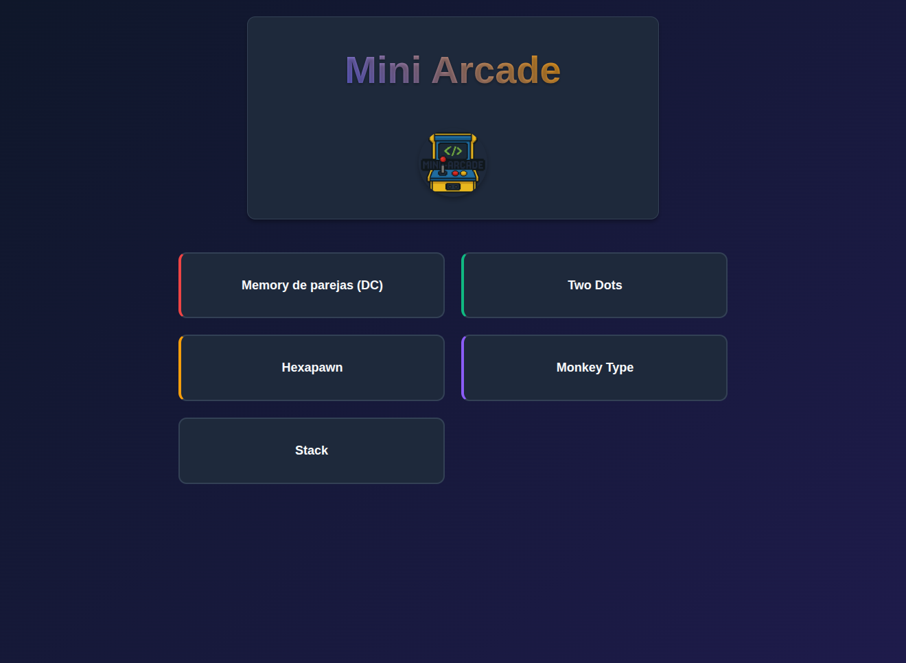

# 🎮 Mini Arcade ✨

A collection of web games — all in one site, built with modern web technologies.

## Description

This project is a collection of small web games built for fun and learning.  
Some were born from online courses, while others came from curiosity — experimenting with web APIs, design ideas, or simply exploring how far plain web technologies can go.

## Live Demo 🌐

The project is available online via Vercel:

**[🎮 Play Now - Mini Arcade](https://mini-arcade-dev.vercel.app/)**

## Design 🎨

See the UI design in [Figma](https://www.figma.com/design/FEBHZo4guKObNeA8UTbSfK/Mini-Arcade?node-id=0-1&t=gLYkOVYzIx4Otxnm-1)

## Stack 🛠️

### Web

- [Astro](https://astro.build/)
- [Tailwind CSS](https://tailwindcss.com/)
- [TypeScript](https://www.typescriptlang.org/)

### Games

#### Vanilla technologies (HTML, CSS, JS)

#### React

- Memory
- Two Dots
- Hexapawn
- Hangman

## Contributing 🤝

Contributions are welcome!  
If you have suggestions or find bugs, please open an issue or submit a pull request.

## License 📄

This project is licensed under the MIT License - see the [LICENSE](LICENSE) file for more details.

---

👨‍💻 Developed with ❤️ by [Luis Marrero](https://luismarrer.github.io/en)
